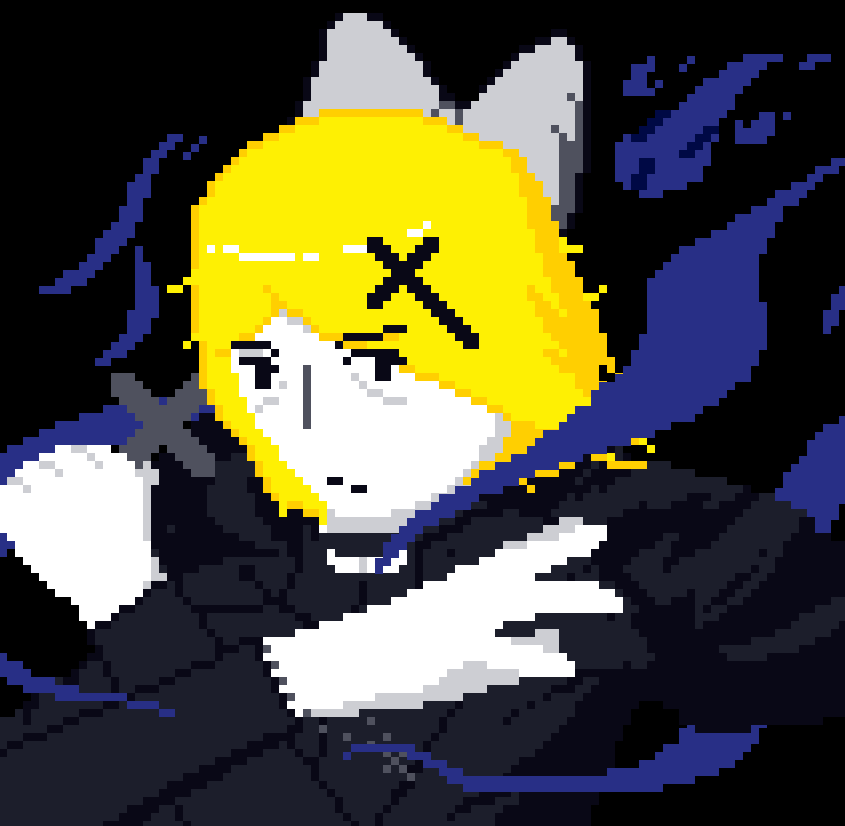
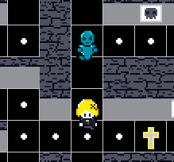
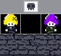

# ✝️🟡 PacMaiden 🟡✝️


<div style="text-align: center;">

</div>

Nesse remake de PacMan, você é PacMaiden, uma exorcista contratada para livrar casas de influências fantasmagóricas. Para fazer isso, ela purifica todos os pontos de maldição do estabelecimento enquanto escapa dos espectros imortais que o assombra.

O jogo foi criado usando RayLib, uma biblioteca de C voltada para o desenvolvimento de jogos. Ele foi desenvolvido como projeto final de Programação II de 2025.2 da UFRJ ministrada pelo prof. Marcos Tomazzoli Leipnitz. O objetivo didático do projeto é, principalmente, praticar alocação dinâmica de memória, estruturas de dados e desenvolvimento em grupo.


<div style="text-align: center;">

</div>


## Jogabilidade
Se movimente usando as setas do teclado ou um controle, coletando todas as bolinhas de cada fase sem ser pego pelos fantasmas. O jogo é um arcade infinito.

<div style="text-align: center;">

</div>


### Fantasmas
PacMaiden trás 4 tipos de fantasmas: 
* **Stalker (Perseguidor) :** Tenta a todo momento chegar mais próximo do jogador.
* ** Ambusher (Encurralador):** Conjectura a posição que a PacMaiden planeja ir e tenta chegar lá antes dela.
* ** Greedy (Guloso):** Busca sempre estar na região com mais pellets sobrando.
* ** Aware (Conciênte):** Se move aleatóriamente para posições na frente 


### PVP
Além da gameplay convencional do PacMan, PacMaiden trambém trás a possibilidade de um multiplayer competitivo. Um jogador controla nas setas  e o outro no wasd .

Nesse modo, os jogadores podem prender seu oponente e matá-lo ao usar Power Pellets, roubando alguns de seus pontos.

Esse modo não é um arcade infinito. Ao coletar todas as pellets ou algum dos jogadores morrer, o jogador com mais pontos é declarado o vencedor.


<div style="text-align: center;">

</div>


## Compilar programa

### Windows
#### Download RayLib
* Instale o MSYS2 (https://www.msys2.org/)
Abra-o MSYS2 e execute
```shell
pacman -S mingw-w64-ucrt-x86_64-gcc
pacman -S mingw-w64-ucrt-x86_64-raylib
```
#### Compilar e rodar
* Clone o repositório na pasta msys/home/user
* Dentro do MSYS2, execute
```shell
gcc PacMaiden/script/src/main.c -o PacMaiden/script/src/jogo -lraylib -lwinmm -lgdi32 -lopengl32
./PacMaiden/script/src/jogo.exe
```
* Alternativamente, você pode executar o arquivo bash runGame, ainda dentro do MSYS2
```shell
./runGame
```

### Linux
#### Download RayLib
Depende da distribuição. 
* Para Ubuntu/Debian e derivados:
```shell
sudo apt update
sudo apt install build-essential
sudo apt install libraylib-dev
```
* Para Arch e derivados
```
pacman -Syu raylib
```

#### Compilar e Rodar
* Vá para o diretório script/src/
```shell
gcc main.c -o main -lraylib -lm -lpthread -ldl -lrt -lX11
./main
```
* Alternativamente, você pode executar o arquivo bash runGame
```shell
./runGame
```
